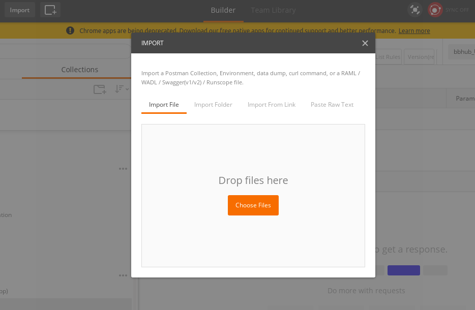

# BitBrew's HUB Postman Scripts

## Postman

We've created templates for relevant API calls that will accelerate your initial
setup. You can download the Postman app [here](https://www.getpostman.com/).

Once you have Postman open, import to Postman using the raw file links from this repository.

- Import our [bbhub collection](https://raw.githubusercontent.com/BitBrew/bbhub-postman/master/bbhub.postman_collection), which contains templates of our API calls.
- Import our [bbhub environment](https://raw.githubusercontent.com/BitBrew/bbhub-postman/master/bbhub.postman_environment), where you can input parameters like your email, password, client ID and tenant ID so you don't have to keep entering them. Here's a tutorial on using [Postman environments](https://www.getpostman.com/docs/environments).

### Additional Parameters

Some of API calls require additional parameters to be added to the URI or
request body. These parameters are not included in the bbhub environment. They
are represented in Postman template syntax (eg. {{parameter}} ).

## Credentials

Contact the BitBrew team to request access to the APIs.

You'll need to put the following information into the Postman environment
variables to make calls in the collection.

- Client ID
- Client Secret
- Tenant ID

## Documentation

### [Tutorials](http://docs.hub.bitbrew.com/docs/getting-started)

Here's a guide to initial setup that shows you how to start. This tutorial,
combined with the postman scripts, should hopefully make setup painless.

### [API Documentation](http://docs.bbhub.apiary.io)

All of our management methods and endpoints, along with example requests and
responses, are documented here.
